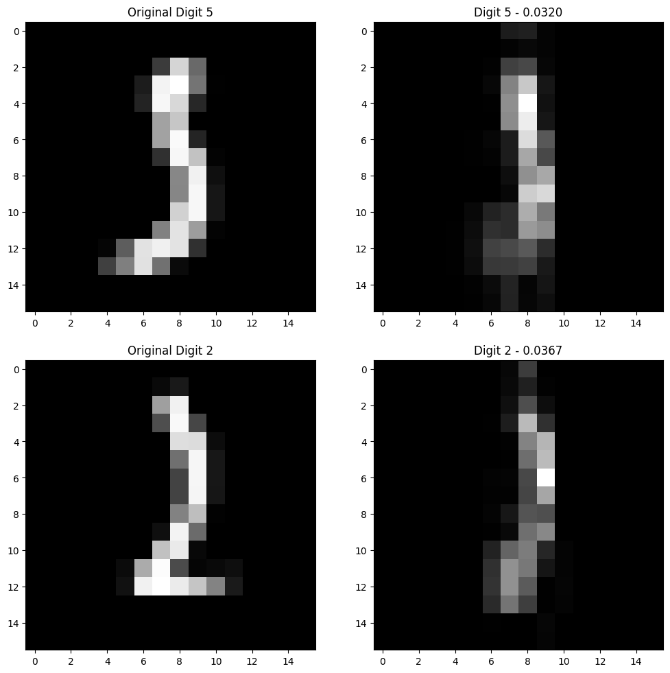

# Quantum Autoencoder

> Author: Peter Buschenreiter
> 
> Supporting Authors:
> Paul-Cristian Mocanu, Seifeldin Sabry
> 
> KdG Coaches: 
> Hans Vochten, Geert De Paepe
> 
> IBM supervisor: Eric Michiels

## Table of contents

- [Introduction](#introduction)
- [Classical Autoencoders](#classical-autoencoders)
- [Quantum Autoencoders](#quantum-autoencoders)
  - [SWAP Test](#swap-test)
- [Quantum Autoencoder Implementation](#quantum-autoencoder-implementation)
  - [Implementation introduction](#implementation-introduction)
  - [Implementation details](#implementation-details)
  - [Results](#results)
  - [Findings and Observations](#findings-and-observations)
- [Conclusion](#conclusion)
- [References](#references)


## Introduction

The goal of this article is to give a general understanding of autoencoders, both classical and quantum, what they are, how they work, and how they can be used to compress data. We will also look at differences and similarities between classical and quantum autoencoder architectures and the state of the art in quantum autoencoders. Finally, we will look at an implementation of a quantum autoencoder using Qiskit, a quantum computing framework developed by IBM and draw some conclusions.

## Classical Autoencoders

Autoencoders are a type of neural network that can be used to compress data. They consist of two parts, an encoder and a decoder. The encoder takes the input data and compresses it into a lower-dimensional representation, called the latent space. The decoder then takes this lower-dimensional representation and tries to reconstruct the original input data. The goal is to have the reconstructed data be as close as possible to the original input data. The encoder and decoder are trained together, so that the decoder learns to reconstruct the original data from the lower-dimensional representation that the encoder produces.


## Quantum Autoencoders

Quantum autoencoders are a type of quantum circuit that can also be used to compress data. They are similar to classical autoencoders in that they also consist of two parts, an encoder and a decoder. The encoder takes the input data and compresses it into a lower-dimensional representation, called the latent space. Different from classical autoencoders, the encoder and decoder are quantum circuits, and the latent space is a quantum state. The decoder then takes this quantum state and tries to reconstruct the original input data into a smaller amount of qubits. Just like in classical autoencoders, the goal is to have the reconstructed data be as close as possible to the original input data and the encoder and decoder are trained together, so that the decoder learns to reconstruct the original data from the quantum state that the encoder produces.


In the picture above, the quantum autoencoder is represented as a quantum circuit. The similarities to the classical autoencoder are evident, being the encoder and decoder parts as well as the different layers.


The quantum autoencoder consists of the following parts:

- **Latent space**: The latent space is a quantum state that is produced by the encoder. It is a lower-dimensional representation of the input data, similar to the latent space in classical autoencoders. It maps one-to-one to the smallest layer of the classical autoencoder.
- **Trash space**: The trash space is a quantum state that gets used up by the encoder, by performing the so-called SWAP test. We will cover that later in more detail. Latent space and trash space together is the input state.
- **Reference space**: The reference space is a quantum state that is used by the decoder to reconstruct the original input data. It is important to already have the reference space, along with the auxiliary qubit and the classical register included in the circuit even though it is not used by the encoder, but only by the decoder. This is because the encoder and decoder are trained together, and the reference space is part of the quantum state that the encoder produces. The reference space is also a vital piece to the SWAP test.
- **Auxiliary qubit**: The auxiliary qubit is the final piece of the puzzle to perform the SWAP test.
- **Classical register**: The classical register is used to measure the auxiliary qubit. 

### SWAP Test


The SWAP test exploits the principles of quantum interference and entanglement to efficiently compare quantum states. Assume we have two quantum states, $|\psi\rangle$ and $|\phi\rangle$. First the auxiliary qubit is set to the $|0\rangle$ state and then prepared with a Hadamard gate (H-gate). That gate maps the basis states $|0\rangle$ and $|1\rangle$ to an equal superposition of both states, giving an equal probability of being measured as $|0\rangle$ or $|1\rangle$ afterwards. This qubit will then be entangled in the next step.

For every qubit in the reference space, a controlled swap gate is applied, controlled by the qubit in the auxiliary space and swapping the qubits in the reference space with the qubits in the trash space. This creates a three-qubit entangled state.

The next step is to apply another H-gate to the auxiliary qubit, followed by a measurement. The probability of measuring the auxiliary qubit in the $|0\rangle$ state is given by the overlap of the two quantum states. If the measurement outcome is $|0\rangle$ with a high probability, the states are similar. If the measurement outcome is $|1\rangle$ with a high probability, it indicates dissimilarity between the states.

You can find a basic implementation of the SWAP test and its visualizations in [this IBM Qiskit Circuit Builder](https://quantum.ibm.com/composer/files/new?initial=N4IgdghgtgpiBcIDKB1AggBQAQBcYGccQAaEARwnygRAHkMBRAOQEU0kBZLAJgDoAGANwAdMAEswAYwA2AVwAmMLMPIxpYgEYBGXhMkqRYUWQBOMAOZYyAbQCsAXUOSzlydYAsj0SYAeACgAHMQB6bgBKK2sAZi8wX0CQ8MjPQwALSP5YyXwAdwgAjPtiSK0iyJinXPzC4ptuMpsU0XSbTMNYSlkzQqwAWgA%2BLDcK0RIQRXxnMQCcMQB7MBoQAF8gA).

## Quantum Autoencoder Implementation

### Implementation introduction

To implement a quantum autoencoder, we will use the Qiskit framework. Qiskit is an open-source quantum computing framework developed by IBM. As for our dataset, we will use the MNIST dataset, which is a dataset of 28x28 pixel grayscale images of handwritten digits. We will use a subset of the dataset, containing only the first 50 images of each digit. We will use a quantum autoencoder to compress the images into a lower-dimensional quantum state and then try to reconstruct the original images from this quantum state.

### Implementation details

To start off, we will first need to do some preprocessing on the dataset. 
1. Normalize the pixel values to be between 0 and 1.
2. Resize the images to be 16x16 pixels, to reduce the number of qubits needed to represent the images.
3. Flatten the images into a 1D array, to be used as input to the quantum autoencoder.
4. Grab the first 50 images of each digit.

Then we can start building the quantum circuit.

```{.python .numberLines}
def auto_encoder_circuit(num_latent, num_trash):
    qr = QuantumRegister(num_latent + 2 * num_trash + 1, "q")
    cr = ClassicalRegister(1, "c")
    circuit = QuantumCircuit(qr, cr)
    ansatz_circuit = RealAmplitudes(num_latent + num_trash, reps=5)
    circuit.compose(ansatz_circuit, range(0, num_latent + num_trash), inplace=True)
    circuit.barrier()
    auxiliary_qubit = num_latent + 2 * num_trash
    # swap test
    circuit.h(auxiliary_qubit)
    for i in range(num_trash):
        circuit.cswap(auxiliary_qubit, num_latent + i, num_latent + num_trash + i)

    circuit.h(auxiliary_qubit)
    circuit.measure(auxiliary_qubit, cr[0])
    return circuit
```

When using this function to create the quantum circuit, we need to specify the number of qubits to use for the latent space and the trash space. It is important to note that the total number of qubits equals the natural logarithm of the dimension of the input data. 

$$
\text{Number of qubits} = \log_2(16*16) = 8
$$

It is obviously important that this number is an integer. Therefore, the dimensions used earlier in the preprocessing step are chosen on purpose.

We will try to compress the images from 8 qubits into a lower-dimensional quantum state of 6 qubits. Therefore, our latent space results in 6 qubits and the trash space in 2 qubits. The reference space, auxiliary qubit and the classical register are already included in the circuit as part of the SWAP test.

```{.python .numberLines}
num_latent = 6
num_trash = 2

fm = RawFeatureVector(2 ** (num_latent + num_trash))

ae = auto_encoder_circuit(num_latent, num_trash)

qc = QuantumCircuit(num_latent + 2 * num_trash + 1, 1)
qc = qc.compose(fm, range(num_latent + num_trash))
qc = qc.compose(ae)
```

Drawing this circuit will result in the following:


Decomposing the block labelled "ReaLAmplitudes", known as the `ansatz` will result in the following:


All of those $R_y$ gates (rotation gates around the y-axis) are the weights of the quantum autoencoder. They are the parameters that will be trained to compress the input data into a lower-dimensional quantum state and then try to reconstruct the original input data from this quantum state.

All that is left, is to define an interpretation function, a Sampler, an optimizer and a cost function.
    
```{.python .numberLines} 
def identity_interpret(x):
    return x
```
    
```{.python .numberLines}
num_of_digits = 10
qnn = SamplerQNN(
    circuit=qc,
    input_params=fm.parameters,
    weight_params=ae.parameters,
    interpret=identity_interpret,
    output_shape=num_of_digits,
)
```
```{.python .numberLines}
opt = COBYLA(maxiter=500)
```
```{.python .numberLines}
def cost_func_digits(params_values):
    probabilities = qnn.forward(training_data, params_values)
    cost = np.sum(probabilities[:, 1]) / training_data.shape[0]
    return cost
```

We can then use the `cost_func_digits` to train the quantum autoencoder using the `opt` optimizer.

```{.python .numberLines}
initial_point = algorithm_globals.random.random(ae.num_parameters)
opt_result = opt.minimize(fun=cost_func_digits, x0=initial_point)
```

Plotting the objective function will result in the following:


### Results

To get the results we build a new quantum circuit, using the same latent and trash space, but this time we reset the reference space to $|0\rangle$.

```{.python .numberLines}
test_qc = QuantumCircuit(num_latent + num_trash)
test_qc = test_qc.compose(fm)
ansatz_qc = ansatz(num_latent + num_trash)
test_qc = test_qc.compose(ansatz_qc)
test_qc.barrier()
test_qc.reset(7)
test_qc.reset(6)
test_qc.barrier()
test_qc = test_qc.compose(ansatz_qc.inverse())
```

Drawing this circuit will result in the following:


We can calculate the fidelity of the reconstructed images with the original images using the following function:

```{.python .numberLines}
def calculate_fidelity(sv1: np.ndarray, sv2: np.ndarray) -> float:
    return np.sqrt(np.dot(sv1.flatten().conj(), sv2.flatten()) ** 2)
```

Calculating the average fidelity of the reconstructed images will result in the following:

| Digit | Fidelity |
|-------|----------|
| 0     | 0.013049 |
| 1     | 0.039238 |
| 2     | 0.014199 |
| 3     | 0.012721 |
| 4     | 0.020714 |
| 5     | 0.014748 |
| 6     | 0.015847 |
| 7     | 0.018089 |
| 8     | 0.017185 |
| 9     | 0.022080 |

Plotting a histogram of these fidelity values will result in the following:


We can see that the fidelity values for the 1 digit are by far the highest, which makes sense since it is the easiest shape.

Plotting a histogram of the individual fidelity values will result in the following:


We can see that the vast majority of fidelity values are between 0.01 and 0.03 and only a few are higher than that.

The following images show some of the best reconstructed images and their original counterparts on the right and left, respectively.


### Findings and Observations

While we are getting some decent recognizable results, the model definitely has some quirks. For instance the model seems to struggle at reconstructing horizontal lines as we can clearly see in the following examples.


And it does a lot better on examples that are more vertical as seen here.



This could indicate a bias towards those sorts of shapes in the training data.

## Conclusion

This technology is still in its infancy and has a long way to go before it can be used in a practical setting. However, it is a very promising technology and has the potential to revolutionize the field of data compression. Quantum autoencoders are a very exciting area of research and have the potential to be a game-changer in the field of quantum machine learning. We unfortunately were not able to test this on a real quantum computer, but we are confident that the results would have been much better.

## References

- [The Quantum Autoencoder - QiSkit Machine Learning 0.7.2. (n.d.).]( https://qiskit-community.github.io/qiskit-machine-learning/tutorials/12_quantum_autoencoder.html)
- [Quantum Variational Autoencoder](https://arxiv.org/pdf/1802.05779.pdf)
