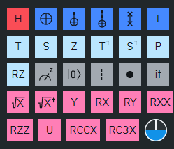
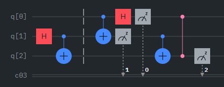

# Unveiling Quantum Computing: The Future of Machine Learning

> Author: Paul-Cristian Mocanu
> 
> Supporting Authors:
> Peter Buschenreiter, Seifeldin Sabry
> 
> KdG Coaches: 
> Hans Vochten, Geert De Paepe
> 
> IBM supervisor: Eric Michiels

## Table of contents
- [Fundamentals of Quantum Computing](#fundamentals-of-quantum-computing)
  - [Quantum Bits (Qubits)](#quantum-bits-qubits)
  - [Superposition: The Heart of Quantum Computing](#superposition-the-heart-of-quantum-computing)
  - [Entanglement: Quantum Computing's Secret Weapon](#entanglement-quantum-computings-secret-weapon)
  - [Decoherence: The Enemy](#decoherence-the-enemy)
  - [Quantum Gates: The Building Blocks of Quantum Computing](#quantum-gates-the-building-blocks-of-quantum-computing)
  - [Quantum Circuits: Choreographing Quantum Computation](#quantum-circuits-choreographing-quantum-computation)
- [Qiskit](#qiskit)
- [Introduction to Quantum Machine Learning (QML)](#introduction-to-quantum-machine-learning-qml)
  - [Quantum Gates as Machine Learning Models](#quantum-gates-as-machine-learning-models)
  - [Entanglement in Machine Learning Models](#entanglement-in-machine-learning-models)
  - [The Advantages of Quantum Over Classical Computing](#the-advantages-of-quantum-over-classical-computing)
- [Why Investigate Quantum Computing?](#why-investigate-quantum-computing)
- [What's next?](#whats-next)

---
Quantum computing emerges as a beacon of technological evolution, 
promising to surpass the limitations of classical computing. 
This revolutionary domain harnesses the peculiarities of quantum mechanics, 
offering unprecedented computational power. 

Its application spans various fields, including cryptography, optimization problems, and notably, machine learning, 
where it introduces transformative approaches to data analysis and predictive modeling. 
The exploration of quantum computing is driven by its potential to solve complex problems 
that are currently intractable for classical computers, 
presenting a significant leap in computational capabilities.

## Fundamentals of Quantum Computing
### Quantum Bits (Qubits)
At the heart of quantum computing lies the quantum bit, or qubit, 
the quantum counterpart to the classical bit. Unlike bits, 
which reside in a definitive state of 0 or 1, qubits thrive in superposition, 
embodying both states simultaneously. This characteristic enables a quantum computer 
to process complex calculations at a scale unattainable by classical machines.

### Superposition: The Heart of Quantum Computing
Superposition is a fundamental principle of quantum mechanics that allows 
qubits to exist in multiple states simultaneously. 
This concept is what distinguishes quantum computing from classical computing at a fundamental level.

In classical computing, a bit must be in one of two states, 0 or 1. 
However, a qubit in superposition can represent a 0, a 1, or any quantum superposition of these states. 
This means that a quantum computer with n qubits can represent 2^n possible states at once, 
rather than processing each state one by one. 

Superposition enables quantum computers to perform a vast number of calculations simultaneously, 
dramatically increasing their processing power for certain tasks, such as factoring large numbers, 
searching databases, and simulating quantum physical processes.

### Entanglement: Quantum Computing's Secret Weapon
Entanglement is another quantum phenomenon that plays a crucial role in the power of quantum computing. 
When qubits become entangled, the state of one qubit instantaneously influences the state of another, no matter the distance between them.

This _[spooky action at a distance](https://en.wikipedia.org/wiki/Quantum_entanglement#History)_ forms the backbone of quantum computing's parallel processing capabilities.

Entangled qubits can be used to perform operations on multiple qubits simultaneously, regardless of their physical location. 
This property not only contributes to the exponential speedup of quantum calculations but also enables new types of quantum algorithms that are impossible for classical computers.

For instance, quantum entanglement is crucial for quantum cryptography, 
allowing secure communication that is theoretically immune to eavesdropping. 
Additionally, entanglement enhances quantum error correction, 
providing a way to protect quantum information from the effects of decoherence and other errors, 
which is vital for the development of reliable quantum computers.

### Decoherence: The Enemy
Decoherence is a critical obstacle in quantum computing, 
stemming from unwanted interactions between qubits and their environment. 
These interactions cause qubits to lose their quantum properties, 
such as superposition and entanglement, reducing them to classical states. 
Essentially, decoherence disrupts the delicate quantum states that are crucial for quantum computations, 
leading to errors and loss of information. 

Overcoming this challenge is vital for the development of effective quantum computers, 
necessitating advanced techniques for isolating qubits from environmental interference and devising robust error correction methods.

### Quantum Gates: The Building Blocks of Quantum Computing
Quantum gates are the quantum equivalent of classical logic gates, 
but with capabilities that extend beyond simple binary operations. 
These gates operate on qubits, exploiting quantum phenomena such as 
superposition and entanglement to perform complex calculations. 
Here are some examples of quantum gates:

- **Hadamard Gate (H gate):** The Hadamard gate is one of the most important quantum gates, 
used to create superposition states from initial qubit states. 
When applied to a qubit in a definite state (0 or 1), 
the Hadamard gate transforms it into a state of equal superposition of both 0 and 1, 
effectively putting the qubit into a quantum state where it represents both values simultaneously. 
This gate is crucial for algorithms that require qubits to be in superposition, 
such as the quantum Fourier transform and Grover's search algorithm. 

- **CNOT Gate (Controlled-NOT Gate):** The CNOT gate is a crucial quantum gate that performs a conditional operation, 
flipping the state of a target qubit only if the control qubit is in the state 1. 
This gate is instrumental in creating entangled states between qubits, 
which is a foundational aspect of quantum computing enabling complex algorithms and quantum error correction mechanisms. 
The ability to conditionally alter the state of qubits based on the state of others introduces 
a level of complexity in quantum computations not present in classical computing.

- **SWAP Gate:** The SWAP gate exchanges the states of two qubits, essentially "swapping" their positions. 
This operation is particularly useful in quantum circuits where the spatial arrangement of qubits affects 
the feasibility and efficiency of gate operations, 
especially in hardware implementations where qubit connectivity can be limited. 
The SWAP gate ensures that quantum algorithms can be executed even when direct interactions between 
certain qubits are not possible due to physical constraints.

- **Rotation Gates (Rx, Ry, Rz):** These gates rotate qubits around the x, y, and z axes on the Bloch sphere, respectively. 
[The Bloch sphere](https://en.wikipedia.org/wiki/Bloch_sphere) is a representation of the state space of a qubit, 
and rotations on the sphere change the state of the qubit. 
Each gate takes an angle θ as a parameter and applies a rotation by θ radians about its respective axis.

- **Rx Gate:** Rotates a qubit around the x-axis. 
This gate is useful for altering the phase of a qubit, transitioning between states.

- **Ry Gate:** Rotates a qubit around the y-axis. 
 It can be used to adjust the probabilities of a qubit's state measuring as 0 or 1, effectively changing the qubit's state from one basic state to a superposition or another basic state.

- **Rz Gate:** Rotates a qubit around the z-axis. 
This gate primarily affects the phase of a qubit without changing its amplitude, which is important for operations that involve quantum interference and phase-based algorithms.

### Quantum Circuits: Choreographing Quantum Computation
Quantum circuits are the framework within which quantum gates are arranged and sequenced to perform quantum computations. 
A quantum circuit is a step-by-step blueprint for processing qubits to achieve a desired computational outcome. 
Each circuit consists of a series of quantum gates, 
much like a classical circuit consists of a series of logic gates. 
However, unlike classical circuits, quantum circuits operate on qubits in superposition and can exploit entanglement, 
enabling parallel processing of information and the execution of complex algorithms more efficiently than classical counterparts.

The design of a quantum circuit involves strategically placing quantum gates to manipulate qubit states and their entanglements, 
aiming to solve specific problems. 
For instance, a quantum algorithm for factoring large numbers, such as Shor's algorithm, 
requires a carefully designed quantum circuit that can exploit quantum mechanics to perform tasks exponentially faster than classical algorithms. 
Similarly, quantum circuits for quantum machine learning models use specific arrangements of gates to 
optimize and execute algorithms that can analyze and model complex datasets beyond the capabilities of classical computing.

In essence, quantum circuits represent the structured application of quantum gates to harness the principles of 
quantum mechanics for computation. 
The careful arrangement of gates like the Hadamard and rotation gates (Rx, Ry, Rz) within these circuits is 
critical to achieving the operational goals of quantum computing, 
from secure communication and efficient data analysis to solving previously intractable problems.

## Qiskit
[Qiskit](https://www.ibm.com/quantum/qiskit), an open-source quantum computing software development framework, 
offers tools for creating and manipulating quantum circuits. 
It serves as a bridge for programmers to experiment with quantum algorithms without needing a deep background in quantum physics. 
By using Qiskit, developers can design quantum circuits with various gates, 
such as the Hadamard gate that creates superposition or the CNOT gate that entangles qubits, 
laying the groundwork for quantum computing applications in machine learning and beyond.

## Introduction to Quantum Machine Learning (QML)
Quantum Machine Learning amalgamates quantum computing with machine learning, 
aiming to leverage quantum mechanics to enhance computational models. 
QML exploits the unique properties of quantum systems to develop algorithms with capabilities beyond the reach of classical computing.

### Quantum Gates as Machine Learning Models
In the realm of QML, quantum gates can function analogously to the layers in a neural network, 
facilitating the construction of intricate model architectures. 
These quantum layers manipulate information in a high-dimensional space, 
enabling the modeling of complex patterns and relationships within data.

### Entanglement in Machine Learning Models
Entanglement introduces a novel approach to correlating data points in machine learning. 
By entangling qubits, QML models can capture intricate correlations within data, 
offering insights that are elusive to classical models. 
This ability to represent and analyze complex datasets is particularly advantageous 
in tasks such as pattern recognition and predictive modeling.

### The Advantages of Quantum Over Classical Computing
The exploration of quantum computing is motivated by its potential to outperform classical computing in several key areas:

- **Speed and Efficiency:**
Quantum computing can process complex problems exponentially faster than classical computing, thanks to quantum parallelism.
- **Solving Intractable Problems:** 
Quantum computers have the potential to solve problems deemed intractable for classical computers, 
such as simulating quantum physical processes, optimizing large systems, and breaking current cryptographic codes.
- **Enhanced Machine Learning Models:** 
Quantum computing introduces new paradigms in machine learning, 
including the ability to process and analyze high-dimensional data more efficiently. 

## Why Investigate Quantum Computing?
The decision to explore quantum computing was fundamentally strategic, 
aimed at harnessing the anticipated theoretical advantages that quantum mechanics offers for computational power. 
At its core, the venture into quantum computing was motivated by the promise of achieving capabilities far beyond 
what is possible with classical computers. 

Theories predict that quantum computing can process information at an unprecedented scale and speed,
offering solutions to problems considered impossible by today's standards. 
This potential for quantum advantage drove us to investigate.

Embracing quantum computing was about seizing an opportunity to leap ahead, 
to position ourselves at the forefront of a technological revolution. 
The theoretical underpinnings of quantum computing suggest that it can perform certain calculations 
exponentially faster than the best supercomputers, transforming data analysis, machine learning, 
and even the way we approach climate modeling. 

This wasn't just about keeping pace with technological evolution; 
it was a conscious decision to sprint ahead,
to capitalize on the quantum leap expected from applying the principles of quantum mechanics to computation. 

Our exploration was rooted in the belief that the first to unlock these capabilities could redefine the landscape of
computational power, gaining a monumental advantage in solving some of humanity's most pressing challenges.

## What's next?

Dive deeper into the transformative potential of quantum computing within the realm of machine learning by 
exploring our trio of specialized articles on [quantum auto-encoders](https://shorturl.at/ovwKO), 
[quantum regression](https://shorturl.at/dls49), 
and [quantum reinforcement learning](https://shorturl.at/dtG24). 
Each piece is crafted to unravel the complexities and applications of these advanced quantum computing techniques in 
enhancing predictive modeling, data analysis, and decision-making processes. 
Join us on this journey into the quantum realm by reading our articles on the mentioned use cases.

