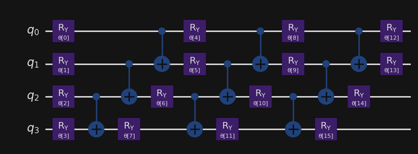
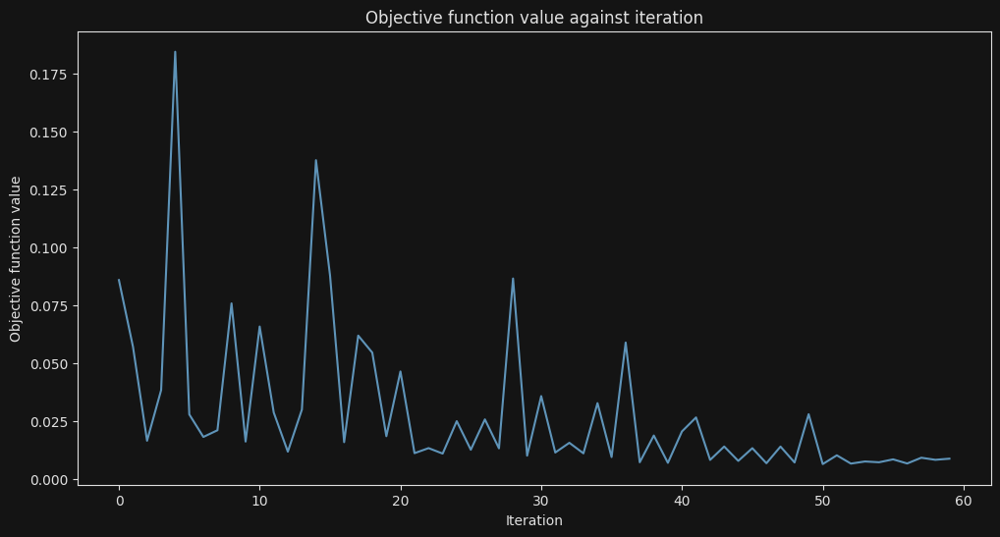
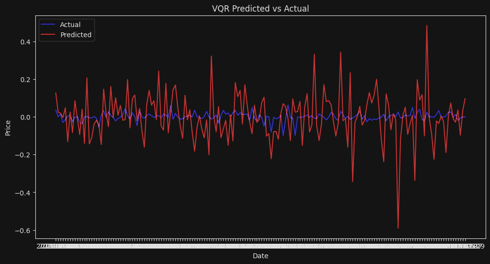
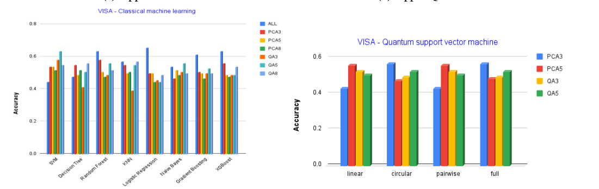
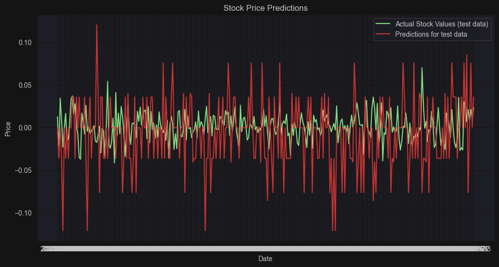

# Quantum Neural Networks - Forecasting Apple Stock

> Author: Seifeldin Sabry
>
> Supporting Authors:
> Peter Buschenreiter, Paul-Cristian Mocanu 
>
> KdG Coaches:
> Hans Vochten, Geert De Paepe
>
> IBM supervisor: Eric Michiels


## Table of contents:

- [Introduction](#introduction)
- [The Dataset](#the-dataset)
- [Quantum Regressors](#quantum-regressors)
- [Drawbacks of Quantum Only](#drawbacks-of-quantum-only)
- [Variational Quantum Neural Network Implementation](#variational-quantum-neural-network-implementation)
- [Conclusion](#conclusion)
- [References](#references)


## Introduction

This article will cover the differences in performance of Quantum Regressors. Hybrid models and Quantum-only models will be evaluated and compared with each other to see which one performs better.

Quantum computing is the use of different quantum states of subatomic particles to store information. There are many different degrees of freedom that the probability of an outcome depends on, there are also different qubit phases that the probability of an outcome depends on.
This means that quantum computing can solve problems that are intractable for classical computers, such as simulating the behaviour of molecules, and optimising complex systems.

Quantum computing can be used to solve problems in finance, such as predicting stock prices, and optimising portfolios. Quantum computing can also be used to solve problems in logistics, such as optimising supply chains, and in healthcare, such as optimising drug discovery.

The purpose of this research will be focusing on the use of quantum computing in finance using quantum machine learning techniques, and in particular, in predicting stock prices.

## The Dataset

For this research, the Apple Stock dataset will be used. The dataset can be found [on kaggle](https://www.kaggle.com/datasets/varpit94/apple-stock-data-updated-till-22jun2021).
A sample of how the data looks:


```{.python .numberLines}
df = pd.read_csv('./data/Apple stock.csv')
df.head()
```
___
Output:
```
         Date      Open      High       Low     Close  Adj Close     Volume
0  1980-12-12  0.128348  0.128906  0.128348  0.128348   0.100323  469033600
1  1980-12-15  0.122210  0.122210  0.121652  0.121652   0.095089  175884800
2  1980-12-16  0.113281  0.113281  0.112723  0.112723   0.088110  105728000
3  1980-12-17  0.115513  0.116071  0.115513  0.115513   0.090291   86441600
4  1980-12-18  0.118862  0.119420  0.118862  0.118862   0.092908   73449600
```
___

The data goes all the way to 2022-03-23.

Some necessary data transformations need to be performed to be used. We are using a `time series` dataset. 

What is time series? Time series forecasting means to forecast or to predict the future value over a period of time. It entails developing models based on previous data and applying them to make observations and guide future strategic decisions.

Based on that these are different data inputs that will be added to the dataset:

___
```{.python .numberLines}
df['RETURNS'] = df['Close'].pct_change()
df['PRX_MA_ND'] = df['Close'].rolling(window=5).mean()
df['VOLATILITY'] = df['Close'].rolling(window=5).std()
df['TP1_RETURNS'] = df['RETURNS'].shift(-1)

df.dropna(inplace=True)
df = df.set_index('Date')
```
___
1. `df['RETURNS'] = df['Close'].pct_change()`: Calculates the percentage change in the closing price of the stock from one period to the next.
2. `df['PRX_MA_ND'] = df['Close'].rolling(window=5).mean()`: Calculates the moving average of the closing price over a rolling window of 5 periods.
3. `df['VOLATILITY'] = df['Close'].rolling(window=5).std()`: Calculates the standard deviation of the closing price over a rolling window of 5 periods, representing the volatility.
4. `df['TP1_RETURNS'] = df['RETURNS'].shift(-1)`: This line shifts the 'RETURNS' column by one period backward (negative shift) and assigns the result to a new column named 'TP1_RETURNS'. This is often done to represent the returns for the next period.

the transformation of `df['TP1_RETURNS']` is essential as it turns this into more of a classification problem, where the purpose is to predict the direction of the stock price, rather than the price itself. 

# Quantum Regressors

Before introducing quantum regressors, it is important to grasp these important concepts:

1. Classical Regressors (Neural Networks and co)
2. Quantum Circuits
3. Qiskit

What are classical regressors?
Knowledge of classical methods in AI is a prerequisite, however, for a refresher please refer to [this introduction into classical models](https://arunp77.medium.com/regression-algorithms-29f112797724)

For knowledge of basic quantum computing concepts, please refer to our [Introduction to Quantum Computing Article](https://medium.com/@cristi.mocanu25/e60d34bd52fe)

Now to get into the first experiment of this research. First experiment was trying Qiskit tutorials applying different Quantum models on real datasets or mock dataset.
Following [this tutorial](https://qiskit-community.github.io/qiskit-machine-learning/tutorials/02_neural_network_classifier_and_regressor.html)

```{.python .numberLines}
df_x = df[['RETURNS', 'Volume', 'PRX_MA_ND', 'VOLATILITY']]
df_y = df['TP1_RETURNS']

df_x_scaler = MinMaxScaler().fit(df_x)

forward_test_date = '2021-01-01'

fdf_x = df_x.loc[forward_test_date:]
fdf_y = df_y.loc[forward_test_date:]
df_x = df_x.loc[:forward_test_date]
df_y = df_y.loc[:forward_test_date]


# random state to easily observe different tests
x_train, x_test, y_train, y_test = train_test_split(df_x_scaled,
                                                    df_y,
                                                    test_size=0.25,
                                                    random_state=42)
```

As you can see, some necessary time-series specific transformations were used. As we are predicting future stock we must still maintain the same order.

According to Qiskit here is how our circuit might look:



One observation was clear from using just the qiskit models such as VQR. That with the amount of training data (9000+ rows) it would prove to be too slow to train the models. 
For the purpose of this research it was very risky to put it into motion and just train it without an indication as to how long it could take.



Different optimisers were used to try to get the most accurate results, however that wasn't a success. The best result so far from VQR only was way off:



A similar experiment was also done using the EstimatorQNN model, however the results were not as good as expected. The model was almost random.

Keep in mind that for this dataset and following the tutorial, every feature is mapped to a qubit. Amongst other experiments with other datasets, it would be impossible to run due to the sheer number of features, and although PCA and other dimensionality reduction algorithms exist, even newly UMAP, it would be impossible to prevent more than 70% loss of information depending on the number of features.

## Drawbacks of Quantum Only
The main drawback of using quantum computing for financial predictions is the computational complexity. Quantum computing is still in its early stages, and the hardware and software are not yet mature enough to handle large-scale financial datasets. The quantum algorithms and models used for financial predictions are still in the experimental stage, and they are not yet as accurate or efficient as classical machine learning models.
Quantum annealing is a technique that could've helped evaluate our dataset to extract the best feature combinations more efficiently and accurately than PCA.

> Quantum Annealing (QA) based on Quantum Computing
techniques, has emerged as a promising approach for feature
selection in various domains. As an optimization technique,
QA aims to find the optimal feature subset that maximizes
or minimizes a given objective function. In the context of
feature selection, QA explores the energy landscape of the
feature space, seeking the most relevant features that contribute
significantly to the predictive power of a model. Unlike classical feature selection methods, QA can efficiently explore a
vast number of possible feature combinations simultaneously,
potentially leading to more accurate and efficient feature
selection - Srivastava, N., Belekar, G., Shahakar, N., & Babu H., A. (2023). The potential of quantum techniques for stock price prediction. 2023 IEEE International Conference on Recent Advances in Systems Science and Engineering (RASSE). doi:10.1109/rasse60029.2023.10363533

Why would this help? Well currently we are feature engineering what we would like to predict, to further check and optimise this step we can use Quantum Annealing to check whether we would get better results with different feature combinations. This would be a great way to optimise the feature selection process and to improve the accuracy of the model.
Theoretically, we should see better results with Quantum Annealing, but this is a result made for VISA stock by the same researchers, comparing both classical and quantum computing, utilising both PCA and Quantum Annealing:



To observe, Quantum Annealing performed worse than PCA in some cases. And of course, the results are overall better classically due to the maturity of the classical algorithms.

## Variational Quantum Neural Network Implementation
Since the Qiskit library didn't quite provide the results necessary, at least in a reasonable time, one option was to research and try to implement a hybrid model. Thanks to the research done by [TensorFlow Variational Quantum Neural Networks in Finance](https://developers.lseg.com/en/article-catalog/article/tensorflow-variational-quantum-neural-networks-in-finance), this was possible.
A hybrid model will utilise both classical and quantum algorithms to solve a problem. The use of a hybrid model can provide the best of both worlds, combining the strengths of classical and quantum computing to solve complex problems more efficiently and accurately than either approach alone.

The architecture is very straightforward:

1. Classical Parameters
2. Classical Algorithm
3. Quantum Parameters
4. Quantum Circuit
5. Quantum Output (probabilities)
6. Classical Optimiser
7. Repeat

The Classical parameters are the weights and biases of the classical algorithm. The output of the classical algorithm is converted into a quantum input and the quantum circuit is created. After executing the quantum circuit, the quantum output is used and passed to a classical optimiser to observe and update the parameters in the first step. This process is repeated until the classical stop condition is met.

How the VQNN model was made is dynamic based on the previous state probabilities of the newly made quantum circuit.
At the start the probabilities are distributed evenly and make a default circuit. As the iterations occur and the model is trained the parameters and probabilities of the last iterations are evaluated and used to initialise the new circuit.

```{.python .numberLines}
self.phase_probabilities = tf.constant([1] * self.qubit_num)
self.layer = self.superposition_qubits(self.probabilities, self.phase_probabilities)

def superposition_qubits(self, probabilities: tf.Tensor, phases: tf.Tensor):
    layer = qiskit.QuantumCircuit(self.qubit_num)
    reshaped_probabilities = tf.reshape(probabilities, [self.qubit_num])
    reshaped_phases = tf.reshape(phases, [self.qubit_num])
    static_probabilities = tf.get_static_value(reshaped_probabilities[:])
    static_phases = tf.get_static_value(reshaped_phases[:])

    for ix, p in enumerate(static_probabilities):
        p = np.abs(p)
        theta = self.p_to_angle(p)
        phi = self.p_to_angle(static_phases[ix])
        layer.u(theta, phi, 0, ix)
    return layer
```


After every iteration and quantum job completion the probabilities are adjusted based on the quantum job results:
```{.python .numberLines}
def calculate_qubit_set_probabilities(self, quantum_job_result):
    qubit_set_probabilities = [0] * self.qubit_num
    for state_result, count in quantum_job_result.items():
        for ix, q in enumerate(state_result):
            if q == '1':
                qubit_set_probabilities[ix] += count
    sum_counts = sum(qubit_set_probabilities)
    if not sum_counts == 0:
        qubit_set_probabilities = [i/sum_counts for i in qubit_set_probabilities]
    return qubit_set_probabilities
```

A dense driver layer, the quantum layer of 2 qubits will act as the interim layer before a classical single neuron regression layer. The model is compiled, and the optimiser options are set.
```{.python .numberLines}
qnn_model = VQNNModel()
qnn_model.compile(optimizer=tf.keras.optimizers.Adam(learning_rate=0.001,
                                                     beta_1=0.9,
                                                     beta_2=0.999,
                                                     epsilon=1e-07),
                  loss=tf.keras.losses.MeanSquaredError(),
                  metrics=["mean_squared_error"])
```
Keeping in mind only 2 qubits were used for this experiment. A total of 50 hours runtime was used to train the model. The results were not as good as expected, but the model was able to predict the trend of the stock price, not exactly the price itself. And it performed better than the VQR model.
Also, there was a lot of room for improvement and adjustments, such as the gradient method adjustment, the number of qubits, a different middle layer, different optimisers, and more.



It is nowhere near a ready state, however it was a great start for a 6 week project and a lot of learning was done. The next steps would be to try to implement a hybrid model with a different architecture, and to try and adjust the VQNN model to be more accurate and faster.
The reason Tensorflow was used is to enable the ability of GPU processing, and the ability to use the Keras API for the model. This helps when saving the model for a later use either due to an error in later iterations or to use the model in a different environment.

## Conclusion
To conclude this research, the use of quantum computing in finance, and in particular, in predicting stock prices is still in its early stages.
The findings that have been made by researchers apply theories that have been around since the 2000s, but the application of said theory is only recently being put into practice.

The results, for how early quantum is, looks promising. we can appreciate the strides being made in integrating quantum techniques into financial prediction models. Such research sheds light on novel approaches and methodologies that leverage quantum computing's unique properties to address longstanding challenges in finance. Given how early quantum computing is, it is only a matter of time before the technology catches up to the theory given how fast it is evolving.
The more leaps and bounds that are made in the field of quantum computing, the more likely it is that we will see a quantum computer that can predict stock prices with a high degree of accuracy.

## References
- [Qiskit](https://qiskit.org/)
- [TensorFlow Variational Quantum Neural Network in Finance](https://developers.lseg.com/en/article-catalog/article/tensorflow-variational-quantum-neural-networks-in-finance)
- [QuantumLeap: Hybrid quantum neural network for financial predictions](https://www.sciencedirect.com/science/article/pii/S0957417422000720)
- [The Potential of Quantum Techniques for Stock Price Prediction](https://arxiv.org/pdf/2308.13642.pdf)
- [Unveiling Quantum Computing: The Future of Machine Learning](https://medium.com/@cristi.mocanu25/e60d34bd52fe)
