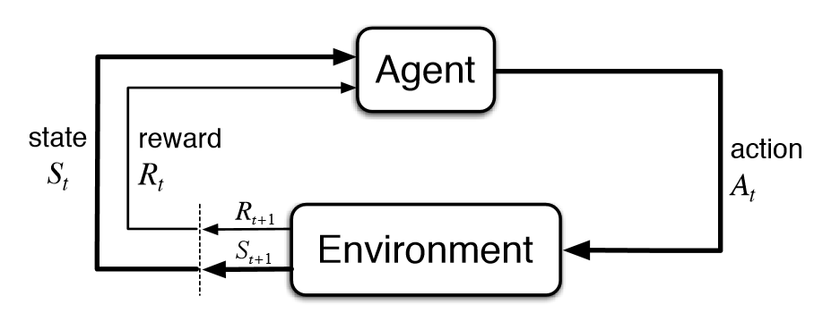
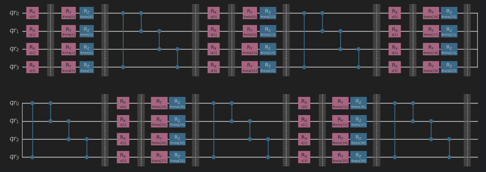
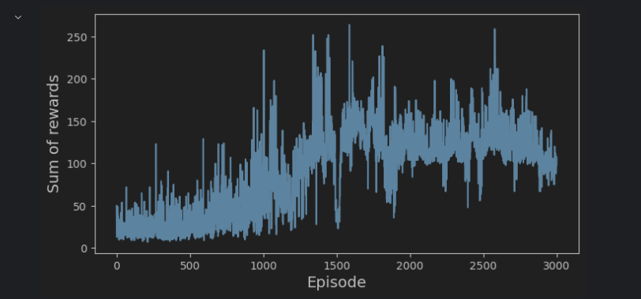

# Quantum Reinforcement Learning


## Table of Contents
1. [Introduction](#introduction)
2. [Classical Reinforcement Learning: An Overview](#classical-reinforcement-learning-an-overview)
3. [Quantum Reinforcement Learning](#quantum-reinforcement-learning)
   - [QRL Introduction](#qrl-introduction)
   - [Quantum Circuit](#quantum-circuit)
   - [Sampler vs Estimator](#sampler-vs-estimator)
   - [Hybrid Nature of the Model](#hybrid-nature-of-the-model)
     - [Defining the Classical Layers](#defining-the-classical-layers)
     - [Hybrid Quantum-Classical Deep Q-Network](#hybrid-quantum-classical-deep-q-network)
     - [Complete Model](#complete-model)
   - [Environment Setup](#environment-setup)
   - [Result](#result)
4. [Conclusion](#conclusion)


## Introduction

In the rapidly evolving field of artificial intelligence (AI) and machine learning, reinforcement learning (RL) emerges as a powerful paradigm, enabling algorithms to learn optimal actions through trial and error interactions with the environment. Classical reinforcement learning has achieved remarkable successes, from mastering complex games to driving autonomous vehicles.

In contrast, quantum computing utilizes principles of quantum mechanics to process information in ways that classical computers cannot, enabling it to tackle complex problems more efficiently.

By leveraging phenomena like superposition and entanglement, it has the potential to revolutionize fields such as cryptography, material science, and complex system simulations. Essentially, it opens up new possibilities for solving problems that are currently infeasible for classical computing.


## Classical Reinforcement Learning: An Overview

At its core, classical reinforcement learning involves an agent learning to make decisions by interacting with its environment. The agent performs actions, observes the outcomes and rewards, and adjusts its strategy to maximize cumulative rewards over time. 




This learning process involves evaluating state-action pairs to deduce the action that yields the highest reward, a challenge known as the policy optimization problem. 

A popular example illustrating RL's principles is the CartPole problem, where an agent learns to balance a pole on a moving cart, a seemingly simple yet complex task that requires understanding and reacting to dynamic environmental states.

## Quantum Reinforcement Learning

### QRL Introduction

Quantum reinforcement learning (QRL) integrates quantum mechanics principles, such as superposition and entanglement, with reinforcement learning strategies. It exploits the parallel processing capabilities and interconnected nature of quantum computing to efficiently manage and analyze complex, high-dimensional data. This methodology is especially advantageous for addressing challenges with expansive state and action spaces, exemplified by scenarios in OpenAI Gym's simulated environments. Anticipated applications of QRL suggest a future where quantum-powered agents can navigate and resolve tasks with remarkable efficiency and speed, opening new avenues for advanced computational problem-solving.

### Quantum circuit

The backbone of quantum reinforcement learning is the quantum circuit, a sequence of quantum gates designed to perform computations. In our approach, we utilize parametrized Ry and Rz gates along with cyclical entanglement to model the decision-making processes utilizing weighted parameters. The Rx gates adjust the quantum states based on input parameters, which represent the agent's environment. Cyclical entanglement, where each qubit is entangled with its neighbor in a circular manner, enhances the circuit's ability to capture complex correlations between actions and outcomes. This structure allows the quantum circuit to serve as a sophisticated model for evaluating actions within an RL framework.

This architecture is suggested by Skolik et al. in their paper on the quantum agents in the gym. While it is prone to fail upon usage of increased amounts of qubits and layers, this does not concern us due to the small nature of the environment.



For the Rx gates, we define the following method:

```{.python .numberLines}
def input_parameters(inputs, num_qubits):

    qc = qk.QuantumCircuit(num_qubits)
    
    # Encode data with a RX rotation
    for i in range(len(inputs)): 
        qc.rx(inputs[i], i)
        
    return qc
```

```{.python .numberLines}
def parametrized_circuit(num_qubits = 4, reps = 2, insert_barriers = True, meas = False):

    qr = qk.QuantumRegister(num_qubits, 'qr')
    qc = qk.QuantumCircuit(qr)
    
    if meas:
        qr = qk.QuantumRegister(num_qubits, 'qr')
        cr = qk.ClassicalRegister(num_qubits, 'cr')
        qc = qk.QuantumCircuit(qr,cr)
    
        # Define a vector containg Inputs as parameters (*not* to be optimized)
    inputs = qk.circuit.ParameterVector('x', num_qubits)
                
    # Define a vector containng variational parameters
    theta = qk.circuit.ParameterVector('theta', 2 * num_qubits * reps)
    
    # Iterate for a number of repetitions
    for rep in range(reps):

        # Encode classical input data
        qc.compose(input_parameters(inputs, num_qubits = num_qubits), inplace = True)
        if insert_barriers: qc.barrier()
            
        # Variational circuit (does the same as TwoLocal from Qiskit)
        for qubit in range(num_qubits):
            qc.ry(theta[qubit + 2*num_qubits*(rep)], qubit)
            qc.rz(theta[qubit + 2*num_qubits*(rep) + num_qubits], qubit)
        if insert_barriers: qc.barrier()
            
        # Add entanglers (this code is for a circular entangler)
        qc.cz(qr[-1], qr[0])
        
        for qubit in range(num_qubits-1):
            qc.cz(qr[qubit], qr[qubit+1])
        if insert_barriers: qc.barrier()
                    
        # Add final measurements
    if meas: qc.measure(qr,cr)
        
    return qc
```

These two methods help us create the quantum circuit which will be given to the primitive in the following section.

### Sampler vs Estimator

Since the deprecation of the `OpFlow` and `QuantumInstance` in Qiskit, a big problem was figuring out the primitive needed in order to achieve your goal. The *estimator* and *sampler* primitives in Qiskit cater to distinct aspects of quantum computing.

The estimator is designed for calculating the expectation value of a quantum observable. This involves understanding the average outcome when a particular quantum operation is applied to a quantum state. Hence, it is crucial for algorithms where knowing the 'average' effect of an operation helps, such as in variational quantum eigensolvers or quantum chemistry simulations. To be specific, it helps in assessing the properties of a quantum state relative to an observable, which provides insights that are vital for a range of quantum computing applications.

On the other hand, the sampler is focused on generating bitstrings that represent the outcomes of a quantum circuit. It's used when the goal is to explore the probabilistic distribution of outcomes directly, making it ideal for quantum optimization problems or simulating probabilistic processes. While the estimator seeks the 'average' behavior through complex calculations, the sampler provides a straightforward method to observe the actual outcomes and their frequencies, thus offering a glimpse into the probabilistic nature of quantum mechanics. Selecting between these tools depends on whether one's interest lies in the average properties or the outcome distribution of a quantum system.

With this in mind, the obvious choice for our use case was the sampler primitive. 

```{.python .numberLines}
# Select the number of qubits equal to the number of inputs in the environment
num_qubits = 4

# Generate the Parametrized Quantum Circuit
qc = parametrized_circuit(num_qubits = num_qubits, reps = 5)

# Fetch the parameters from the circuit and divide them in Inputs (X) and Trainable Parameters (params)
# The first four parameters are for the inputs 
inputs = list(qc.parameters)[: num_qubits]

# The remaining ones are the trainable weights of the quantum neural network
trainable_params = list(qc.parameters)[num_qubits:]

sampler=Sampler(options={'method': 'statevector'})
sampler.set_options(shots=2048)
qnn = SamplerQNN(sampler=sampler,circuit=qc, input_params=inputs, weight_params=trainable_params)

```

### Hybrid nature of the model

The culmination of our approach is a hybrid quantum-classical neural network, where quantum computations are embedded within a classical neural network architecture. This hybrid model is designed to process inputs from the RL environment, perform complex computations using the quantum layer, and translate the quantum outputs back into classical information to inform the agent's decisions. One other component which plays a pivotal role is the `TorchConnector` from Qiskit Machine Learning, it bridges the gap between quantum operations and the PyTorch-based neural network. This hybrid approach represents a significant step forward in creating AI systems that can harness the unique capabilities of quantum computing to address the challenges of reinforcement learning.

#### Defining the classical layers

Two essential components in this integration are the `encoding_layer` and `exp_val_layer`. The `encoding_layer`, a subclass of `torch.nn.Module`, is designed to encode classical data into a quantum circuit simulation. This is achieved by applying parameterized rotations to the input data, a process facilitated by weights initialized between -1 and 1 for each qubit. The forward method of this layer utilizes these weights along with an arctangent function to simulate the encoding process on a quantum register. 

```{.python .numberLines}
class encoding_layer(torch.nn.Module):
    def __init__(self, num_qubits = 4):
        super().__init__()
        
        # Define weights for the layer
        weights = torch.Tensor(num_qubits)
        self.weights = torch.nn.Parameter(weights)
        torch.nn.init.uniform_(self.weights, -1,1) # <--  Initialization strategy
    
        
    def forward(self, x):
            
        if not isinstance(x, Tensor):
            x = Tensor(x)
        
        x = self.weights * x
        x = torch.atan(x)
                
        return x

```

On the other hand, the `exp_val_layer` focuses on calculating expected values within a quantum simulation. Upon initialization, it sets the size of the action space and initializes weights between 35 and 45, while also defining specific masks for calculating expectation values for quantum operations. Its forward method effectively computes these expected values, catering to both individual samples and batches by applying weights and normalizations to the outputs. 

```{.python .numberLines}
class exp_val_layer(torch.nn.Module):
    def __init__(self, action_space = 2):
        super().__init__()
        
        # Define the weights for the layer
        weights = torch.Tensor(action_space)
        
        self.weights = torch.nn.Parameter(weights)
        torch.nn.init.uniform_(self.weights, 35,45) # <-- Initialization strategy (heuristic choice)
        print(self.weights)
        # Masks that map the vector of probabilities to <Z_0*Z_1> and <Z_2*Z_3>
        self.mask_ZZ_12 = torch.tensor([1.,-1.,-1.,1.,1.,-1.,-1.,1.,1.,-1.,-1.,1.,1.,-1.,-1.,1.], requires_grad = False)
        self.mask_ZZ_34 = torch.tensor([-1.,-1.,-1.,-1.,1.,1.,1.,1.,-1.,-1.,-1.,-1.,1.,1.,1.,1.], requires_grad = False)
        
    def forward(self, x):
        """Forward step, as described above."""
        
        expval_ZZ_12 = self.mask_ZZ_12 * x
        expval_ZZ_34 = self.mask_ZZ_34 * x
        
        # Single sample
        if len(x.shape) == 1:
            expval_ZZ_12 = torch.sum(expval_ZZ_12)
            expval_ZZ_34 = torch.sum(expval_ZZ_34)
            out = torch.cat((expval_ZZ_12.unsqueeze(0), expval_ZZ_34.unsqueeze(0)))
        
        # Batch of samples
        else:
            expval_ZZ_12 = torch.sum(expval_ZZ_12, dim = 1, keepdim = True)
            expval_ZZ_34 = torch.sum(expval_ZZ_34, dim = 1, keepdim = True)
            out = torch.cat((expval_ZZ_12, expval_ZZ_34), 1)
                
        return self.weights * ((out + 1.) / 2.)
```

These layers represent the preprocessing and postprocessing steps essential for bridging classical computing techniques with quantum computational processes, illustrating a promising avenue for enhancing the capabilities of quantum neural networks.

#### Hybrid Quantum-Classical Deep Q-Network

We've gathered all the components required to assemble a hybrid quantum-classical neural network designed to tackle the CartPole challenge.

#### Complete Model

The final hybrid model is constructed by sequentially combining the three layers:
`model` = `encoding_layer` --> `quantum_layer` --> `exp_val_layer`

```{.python .numberLines}
quantum_nn = TorchConnector(qnn) # Torch connector provides the weights uniformly from [-1, 1]

# Classical trainable preprocessing
encoding = encoding_layer()

# Classical trainable postprocessing
exp_val = exp_val_layer()

model = torch.nn.Sequential(encoding,quantum_nn, exp_val)
```

### Environment setup

The environment used in this experiment was the Cartpole-v0 from OpenAI Gymnasium.
It has a continuous state space of 4 variables and an discrete action space of 2.
We used the epsilon-greedy policy to sample the actions and the experience replay buffer to store the experiences and sample them for training the model.
The train method utilizes the Adam optimizer and the Average Mean Squared Error to decrease the loss.

The code can be found [here](https://gitlab.com/kdg-ti/the-lab/teams-23-24/idk/quantum-computing/-/blob/main/QuantumRL/hybridqnn.ipynb).

### Result

The model got trained and managed to surpass 200 steps in an episode but ultimately didn\t achieve an average of at least 195 steps per episode



## Conclusion

While there is a lot of promise in quantum computing and its applications in machine learning,
it is quite obvious to us that it is not a mature technology yet and does not provide a solid base for developing proper solutions. 
During our experience with this technology, we encountered a mountain of deprecated code with no clear substitution. 
Furthermore, the abstractions provided by qiskit seem to complicate the process instead of making it easier for a person with less knowledge.
To conclude, a high amount of knowledge regarding quantum physics and mathematics is needed to fully comprehend the inner workings of the code.  